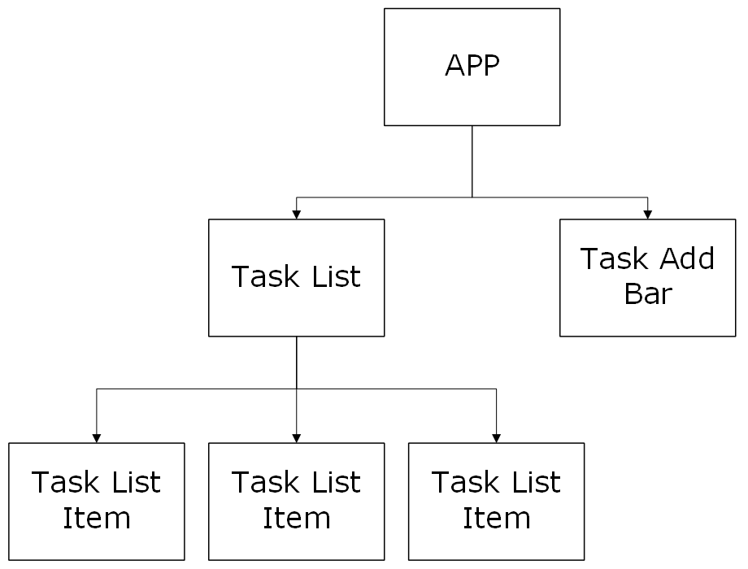

# Assignment 03 - Thinking In React

The goal of this assignment is to follow the [Thinking In React](https://react.dev/learn/thinking-in-react) article from the official React documentation while creating a To-Do list.

## Design Mockup

This is my mockup for the To-Do List Application. 

I broke the app down into 4 components
1. **App** - This is the overall application and contains all other components
2. **Task Add Bar** - this is where the user enters in a task using the input field and clicks "ADD" to add a task to the task list
3. **Task List** - This contains the task list items
4. **Task Item** - This component displays the task name and its completion status. The user can click the checkbox to mark the task as complete or click delete to remove the task item from the task list.

## UI Minimal Representation

Since we know that the application can be broken down into 4 major components, we can structure them into the tree above. App has two children, Task List and Task Add Bar. The Task List has multiple children, each Task List Item.

### Data and State
We have several pieces of data in our application:
- The text input by the user in Task Add Bar
- the value of the checkboxes in each Task List Item
- the total list of tasks
- the original list of tasks

We can determine which of these are state and which  are not by following a few rules:
1. Does it remain unchanged over time &rarr; **NOT STATE**
2. Is it passed in from a parent via props? &rarr; **NOT STATE**
3. Can you compute it based on existing state or props in your component? &rarr; **NOT STATE**

Following these rules we come to the following conclusions:
- The text input - **STATE**
- the value of the checkboxes - *Not State* - can be computed based on total task list values
- the total list of tasks  - **STATE**
- the original list of tasks  - *Not State*

## Identifying where the state should live

1. Identify every component that renders something based on that state.
    - The text input - **STATE**
        - List Add Bar
    - the total list of tasks  - **STATE**
        - Task List
        - List Add Bar
        - Task List Item

2. Find their common parent
    - The text input - **STATE**
        - List Add Bar
    - the total list of tasks  - **STATE**
        - App

3. Decide where the state lives
    - The text input - **STATE**
        - List Add Bar
    - the total list of tasks  - **STATE**
        - App

## Adding Inverse Data Flow
In the App component, I added in 3 helper functions to pass down to the children to change the Task List.
1. addItemToList - takes in a string - creates a new task, marks it incomplete, and generates a new unique ID
2. removeItemFromList - takes in an ID - filters the task list and removes the task with given ID
3. toggleCompleted - takes in an ID - filters the task list and replaces the task with given ID with a copy with inverse completed value

## Conclusion
I definitely learned a lot about proper data flow with this assignment. I remember a few years ago when I tried to learn React and I wanted to add inverse data flow to my application but ran into issues where I was unaware of where my state should live and that lead to serious issues. This assignment taught me how to plan out data flow and heirarchy within my application.