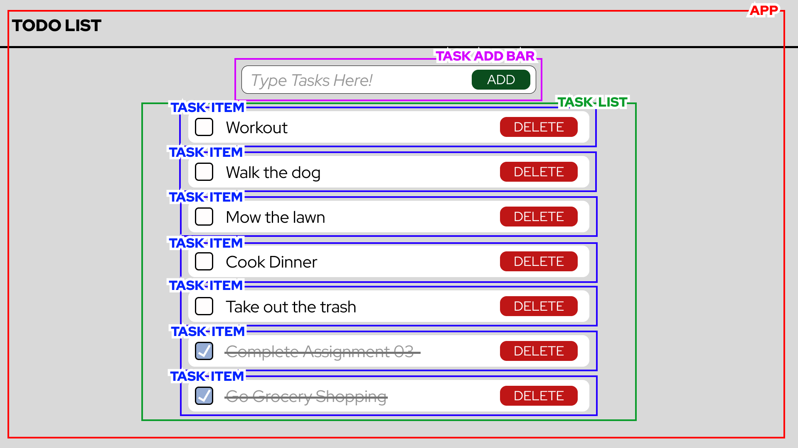

# Assignment 03 - Thinking In React

The goal of this assignment is to follow the [Thinking In React](https://react.dev/learn/thinking-in-react) article from the official React documentation while creating a To-Do list.

## Design Mockup

This is my mockup for the To-Do List Application. 

I broke the app down into 4 components
1. **App** - This is the overall application and contains all other components
2. **Task Add Bar** - this is where the user enters in a task using the input field and clicks "ADD" to add a task to the task list
3. **Task List** - This contains the task list items
4. **Task Item** - This component displays the task name and its completion status. The user can click the checkbox to mark the task as complete or click delete to remove the task item from the task list.

